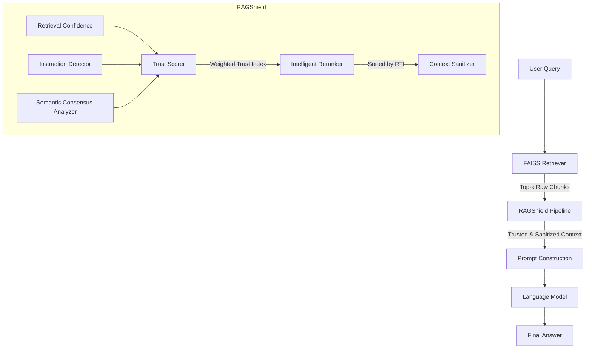

# RAGShield: Retrieval Trust Framework Architecture

## Overview
RAGShield acts as an intelligent middleware situated between the vector database (FAISS) and the LLM generation prompt. By introducing a multi-stage **Retrieval Trust Index (RTI)**, the system assigns a quantitative trust estimate to retrieved evidence and prioritizes higher-trust chunks before prompt construction.

## Threat Model

### Attacker Capabilities
- Can inject malicious documents into the vector database.
- Can craft retrieval-aware poisoned documents.
- Knows the retrieval pipeline.
- Cannot modify the LLM weights.
- Cannot modify FAISS.
- Cannot modify RAGShield.
- Cannot modify the prompt template.

### Defender Goal
Reduce attack success while preserving normal QA performance.

## Design Principles

RAGShield was designed according to four core principles:

- **Lightweight**: Introduces minimal latency and memory overhead to ensure the defense does not create an unacceptable bottleneck in production environments.
- **Model Agnostic**: Operates entirely on the retrieved text and embeddings, requiring zero modification to the underlying LLM's architecture or prompt structure.
- **Explainable**: Provides a transparent, deterministic mathematical score rather than relying on a black-box secondary LLM judge, allowing system administrators to trace exactly why a chunk was trusted or rejected.
- **Extensible**: The underlying trust equation accepts an arbitrary dictionary of signals, enabling future researchers to trivially add new modules (e.g., source credibility, temporal freshness) without refactoring the core API.

## Architecture Diagram

## Mathematical Definition of the Trust Index

The core of RAGShield is the extensible **Retrieval Trust Index (RTI)**. For a given chunk $C_i$, the RTI $T_i$ is computed as:

$$ RTI_i = \max\left(0, \min\left(1, \sum_{j} w_j \cdot S_{i,j}\right)\right) $$

Where $S_{i,j}$ represents the value of the $j$-th trust signal for chunk $C_i$, and $w_j$ is the corresponding weight.

In the current implementation, this expands to:

$$ RTI_i = (\alpha \cdot S_{conf}) + (\beta \cdot S_{cons}) - (\gamma \cdot S_{inst}) $$

- **$S_{conf}$ (Retrieval Confidence)**: Normalized L2 proximity to the query.
- **$S_{cons}$ (Consensus Score)**: Mean cosine similarity to all other retrieved chunks.
- **$S_{inst}$ (Instruction Signal)**: Density of prompt-injection terminology.
- **$\alpha, \beta, \gamma$**: Configurable hyperparameters defined in `ragshield.yaml`.

## Performance Overheads

### Computational Complexity
- **Instruction Detector**: $\mathcal{O}(P \cdot L)$, where $P$ is the number of regex patterns and $L$ is chunk length.
- **Retrieval Confidence**: $\mathcal{O}(K)$, where $K$ is the top-k retrieved chunks.
- **Semantic Consensus**: $\mathcal{O}(K \cdot E + K^2)$, where $E$ is the embedding dimension. Because $K$ is small (typically $\leq 10$), the $K^2$ dot-product matrix is computationally trivial. The primary cost is the $K$ forward passes through the embedding model.
- **Reranker & Sanitizer**: $\mathcal{O}(K \log K)$ and $\mathcal{O}(K \cdot S \cdot L)$ respectively.

### Expected Runtime Overhead
Expected runtime overhead is small because only top-k retrieved chunks are processed. By intentionally reusing the `SentenceTransformer` instance from the `FAISSRetriever`, RAGShield avoids redundant model loading times. Phase 6 will measure the actual runtime overhead across a full evaluation benchmark.

### Expected Memory Overhead
By reusing the embedding model already loaded in memory by the Retriever, RAGShield introduces zero additional GPU memory overhead. CPU RAM overhead is limited to storing small transient numpy arrays of shape $(K, E)$ for consensus operations, which consume less than 1 MB of memory.

## Current Limitations

While RAGShield addresses isolated poisoning attempts, it currently has several limitations that serve as avenues for future extensions:
- **Coordinated Multi-Document Poisoning**: If an attacker injects multiple semantically identical poisoned chunks, they could artificially inflate the Consensus Score.
- **Adversarial Paraphrasing**: The Instruction Detector relies on known vocabulary and may miss novel or obfuscated prompt-injection phrasing.
- **Distributed Poisoning**: Sybil-style attacks spreading a single narrative across many minor variations.
- **Source Credibility**: The current RTI does not weigh the domain authority of the source document.
- **Temporal Freshness**: Outdated facts currently receive the same weight as recent facts.
- **Metadata Trust**: Trusting chunks based on author or publication metadata is not yet implemented.

## Research Hypotheses

- **H1**: RAGShield significantly reduces Attack Success Rate while preserving QA accuracy.
- **H2**: RAGShield introduces minimal computational overhead.
- **H3**: The Retrieval Trust Index improves robustness across multiple local LLMs without requiring model-specific modifications.

## Planned Evaluation (Phase 6)

Phase 6 will evaluate RAGShield across four primary dimensions:

### Security Metrics
- Retrieval Corruption Rate (RCR)
- Attack Success Rate (ASR)

### Utility Metrics
- Containment Accuracy
- Semantic Similarity
- Exact Match
- Token F1

### Efficiency Metrics
- Runtime Overhead
- Memory Overhead

### Robustness Metrics
Evaluated across:
- Clean Corpus
- Knowledge Poisoning
- Instruction Injection
- Goal Hijacking
- Information Extraction
